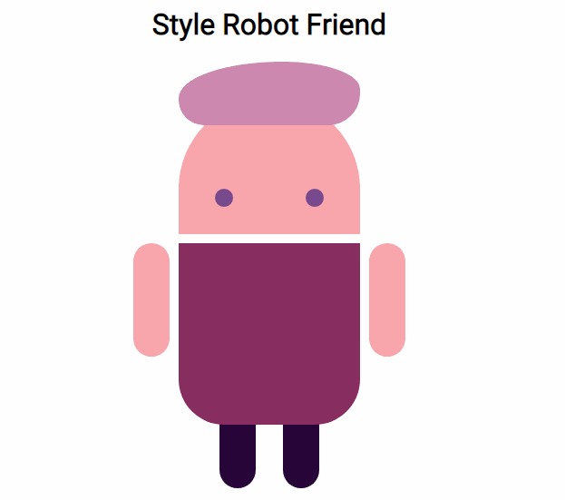

# Project - *Style Robot*

**Style Robot** is an android robot that has style and can dance.

Elements brought together by: **Claudia Bandali**

Time spent: **2** hours spent in total

## Robot Stories

The following functionality is completed:

* [x] Cool Hat
* [x] Matching colord
* [x] proper alignment of body parts
* [x] dancing functionality

## Video Walkthrough

Here's a walkthrough of implemented robot:

GIF created with [LiceCap](http://www.cockos.com/licecap/).

## Notes
Using flexbox I was able to easily put the elements of the robot in their proper positions

## License

    Copyright [2019] [Claudia Bandali]

    Licensed under the Apache License, Version 2.0 (the "License");
    you may not use this file except in compliance with the License.
    You may obtain a copy of the License at

        http://www.apache.org/licenses/LICENSE-2.0

    Unless required by applicable law or agreed to in writing, software
    distributed under the License is distributed on an "AS IS" BASIS,
    WITHOUT WARRANTIES OR CONDITIONS OF ANY KIND, either express or implied.
    See the License for the specific language governing permissions and
    limitations under the License.
